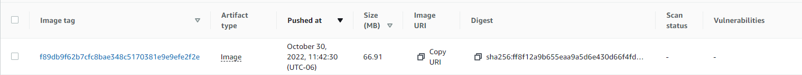

# Github Workflow for building and testing the project

## Deploy

This workflow is triggered on push to the main branch. It builds the project and push it to an AWS ECR repository.
For this deploy to work you need to set the following secrets in the repository settings:
- AWS_ACCESS_KEY_ID
- AWS_SECRET_ACCESS_KEY
- AWS_REGION
- AWS_REPO_NAME

The tag of the image is the commit sha. It will look like this:

