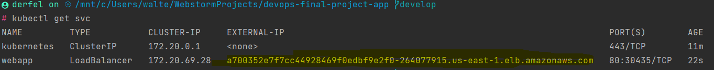

# Application for EKS cluster

Prerequisites
- Docker
- ArgoCD
- AWS CLI
- Kubectl
- MongoDB Atlas Cluster

## Description

This is a simple application that uses a MongoDB Atlas Cluster to store data. The application is deployed on an EKS cluster using ArgoCD.

## Usage


To create the ECR repository, run the following command:

```bash
aws ecr create-repository --repository-name rest-api --image-scanning-configuration scanOnPush=true --image-tag-mutability IMMUTABLE --region us-east-1
```

### Build and push the Docker image

1. Build the Docker image using the following command:

```bash
docker build -t mern-image .  
```

2. Test the image locally using the following command:

```bash
docker run -p 80:80 mern-image
```

After the image is running, navigate to http://localhost:80 in your web browser to verify that the application is running.

3. Create an ECR repository using the following command:
> Note: Make sure to have an IAM user setup with the correct permissions to push to ECR in AWS CLI.

```bash 
aws ecr create-repository --repository-name mern-stack --image-scanning-configuration scanOnPush=true --image-tag-mutability IMMUTABLE --region us-east-1
```

4. Authenticate Docker to your Amazon ECR registry using the following command:

```bash
aws ecr get-login-password --region us-east-1 | docker login --username AWS --password-stdin aws_account_id.dkr.ecr.us-east-1.amazonaws.com
```

5. Tag your image using the following command:

```bash
docker tag mern-stack:latest <Repository URI>/mern-stack:v1
```

6. Push the image to your Amazon ECR repository using the following command:

```bash
docker push <Repository URI>/mern-stack:v1
```
### Deploy the application

1. Create an EKS cluster using the repository [Terraform EKS Cluster](https://github.com/Walter-Gaitan/devops-final-project-terraform)

2. Run manifest.yaml to deploy the application using the following command:

```bash
kubectl create -f manifest.yml
```

You can verify that the application is running by navigating to the public IP address of the load balancer in your web browser. It will look like this



## Github Actions
