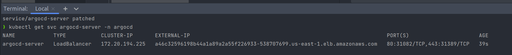

# Configure ArgoCD

1. Setup ArgoCD using the following command:

```bash
kubectl create namespace argocd

kubectl apply \
  --namespace argocd \
  --filename https://raw.githubusercontent.com/argoproj/argo-cd/stable/manifests/install.yaml
  
kubectl wait deploy argocd-server \
  --timeout=180s \
  --namespace argocd \
  --for=condition=Available=True
  
kubectl patch svc argocd-server -n argocd -p '{"spec": {"type": "LoadBalancer"}}'
```

After you wait for around 2 minutes for the Load Balancer to start, you can then connect to ArgoCD using the data displayed in the terminal when using the command 
```
kubectl get svc argocd-server -n argocd
```



2. Navigate to the URL showed in your web browser and login using 
```username: admin``` and for the password get it using the following command on the terminal and paste the result in the ArgoCD CLI
```kubectl -n argocd get secret argocd-initial-admin-secret -o jsonpath="{.data.password}" | base64 -d; echo```

3. In the terminal, run the following command to deploy the ArgoCD application:
```bash
kubectl apply -n argocd -f argocd/application-prod.yaml
```

You will see that the application is now deployed.


4. Open the application to check the available pods. You will see the application running.


5. To get the URL of the application, run the following command:
```bash
kubectl get svc -n mern-stack
```

6. Copy the URL and paste it in your web browser to see the application running.

## Delete the application

To delete the application, run the following command:

```bash
kubectl delete -f argocd/application-prod.yaml
kubectl delete -f k8s -n mern-stack
```