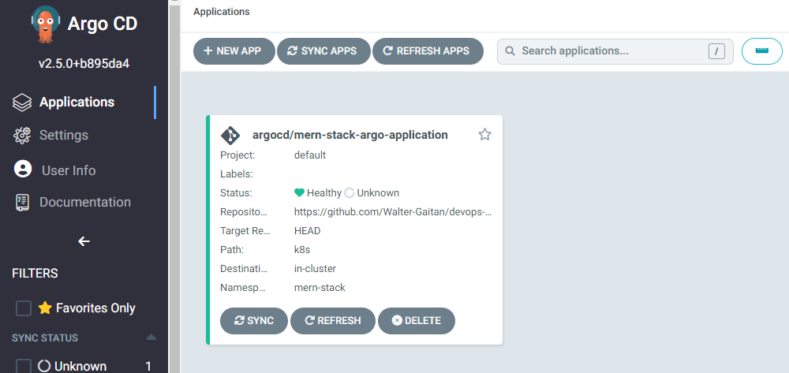
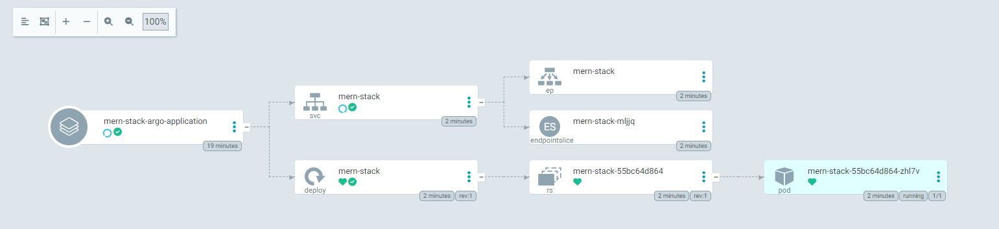

# Configure ArgoCD

1. Setup ArgoCD using the following command:

```bash
kubectl create namespace argocd

kubectl apply \
  --namespace argocd \
  --filename https://raw.githubusercontent.com/argoproj/argo-cd/stable/manifests/install.yaml
  
kubectl wait deploy argocd-server \
  --timeout=180s \
  --namespace argocd \
  --for=condition=Available=True
  
kubectl patch svc argocd-server -n argocd -p '{"spec": {"type": "LoadBalancer"}}'
```

You can now connect to ArgoCD using the data displayed in the terminal when using the command ```kubectl get svc argocd-server -n argocd```

5. Navigate to the  in your web browser and login using the following credentials:
```bash
username: admin
password: $(kubectl get secret argocd-initial-admin-secret -n argocd -o jsonpath="{.data.password}" | base64 -d)
```
You will see that the application is deployed. 
5. Navigate to the application URL. You will see the application running. 