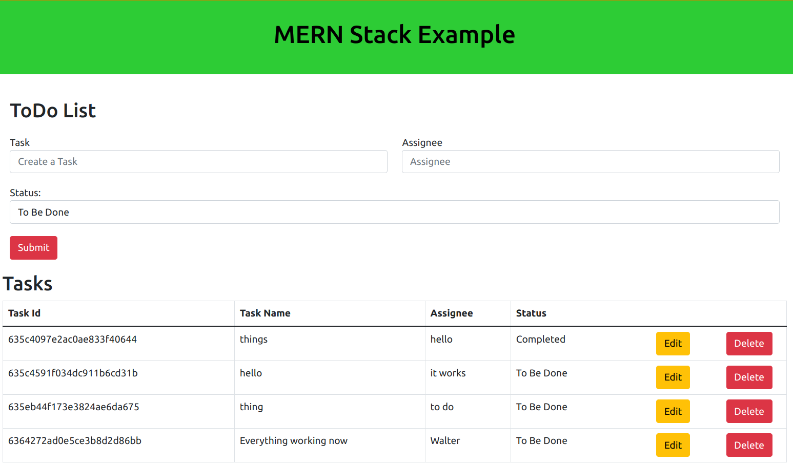

# Mern Stack App

To run the project without using Docker, follow the steps below:
- Install Node.js
- run `npm install` inside the `api` and `ui` folder
- run `npm test` to launch the interactive test runner
- `npm run build` to build the app for production to the `build` folder

To run the project using Docker, follow the steps below:

Run the following commands to build and run the Docker image:

```bash
docker build -t mern-stack .
docker run -p 80:80 mern-stack
```

This will run the application on port 80 using the `production` version. Navigate to http://localhost:80 in your web browser to verify that the application is running.


